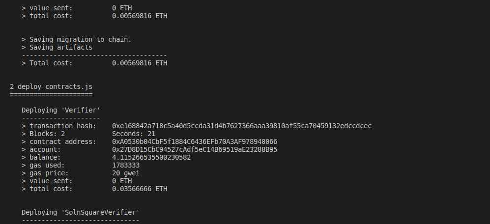
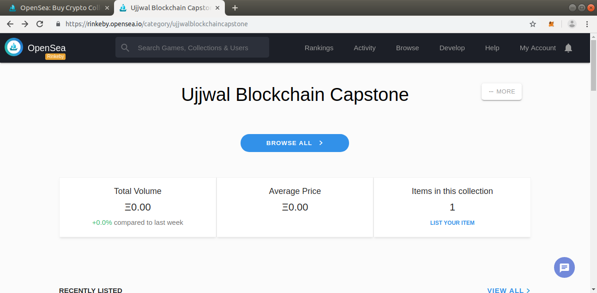

# Real-Estate-Capstone
This is a sample decentralized application for Real Estate marketplace wherein user can transfer the title and the ownership of properties(real estate) can be tracked effectively. This project uses OpenSea to list the property token for sale.

## Getting Started

These instructions will get you a copy of the project up and running on your local machine for development and testing purposes.

## Prerequisites
Please make sure you've already installed 
  Tools and  used version
*   node (v10.16.0)
*   npm  (6.0.0)
*   Ganache CLI v6.4.4
*   Truffle (v5.0.10)
*   Solidity - 0.5.0 (solc-js)
*   MetaMask extension for chrome browser
*   Web3.js v1.0.0-beta.37

## Installing
Please follow the following steps to get the environment up and running.

#### Create a local working directory and then  clone github repository:
Clone the github repository
Install the required node packages as listed in 'package.json'
```
npm install
```

#### Open a terminal window and Launch Ganache-cli:
```
ganache-cli -p 8545 -m "spirit supply whale amount human item harsh scare congress discover talent hamster" --gasLimit 300000000 --gasPrice 20000000000 -a 20

```
#### Open a separate terminal window and change the directory to eth-contracts
Change to the folder ```eth-contracts``` 


#### Compile the Project 
```
truffle compile
```

#### Migrate smart contracts to the locally running blockchain:` 
```
truffle migrate
```

#### Test smart contracts:
```
truffle test 
```


All tests should pass.


### Deployment to Rinkeby

In order to deploy to Rinkeby test network, the `truffle-config.js` file has to be appropriately modifier by providing Infura key.
After that run the following command on the terminal
```
truffle migrate --network rinkeby --reset
```




The deployed contract can be found in:

Solution Square verifier: https://rinkeby.etherscan.io/address/0xFc9d788F8ABE76dccbf4D2797fdF119D9ECf2663
Verifier: https://rinkeby.etherscan.io/address/0xA0530b04CbF5f1884C6436EFb70A3AF978940066
Migrations: https://rinkeby.etherscan.io/address/0x9b714D56e3b1d6488085289fc957813827efF114


### Mint 10 Tokens

1) Minted Token. Transaction: 0x2a7e27c30e5c1ffa5fa61dce66506a8dd304b7671ea98898d11c268b000932ce
2) Minted Token. Transaction: 0x92fc601c8893e9703c1089184242e735ec2a629b967b26219bf6566f26ff0a21
3) Minted Token. Transaction: 0xee6674f78ea00a584c4600078b3d3089458059bef228b8bf8ed117f2557fc828
4) Minted Token. Transaction: 0xbb8af50eda7b0557037c7a48c941261e888cd740bed2bc4639a931ece6b12b6b
5) Minted Token. Transaction: 0x82c8c181264cec6ba51e1b723453826248b1be9551d3cc9f72aed8322a511b09
6) Minted Token. Transaction: 0x5e5503b736051ea5ce1ad13de0d0305e29adf7804745d9c3db68194c3cf11d6e
7) Minted Token. Transaction: 0xdeee0beed3c2eb7c76578aa962262dcad9bc2c1405ce5a451f2e93fe71a6df36
8) Minted Token. Transaction: 0x47740dc5a6738cbf4e17685b915bb116ae0b1a01fc47c629b21d8547abebc950
9) Minted Token. Transaction: 0xaf66303a16adfc3904e564d2e4d4b083a09cfca97fdc4e27863b1137a15e0af5
10)Minted Token. Transaction: 0xc5efabca3fb2943c15834b16c4b57480c517709565e8c2b428faa29610557dbb

### Open Sea Token listing and Transaction
Visit https://rinkeby.opensea.io/category/ujjwalblockchaincapstone

Click on Item in this collection


From the Categories list, select "Ujjwal Blockchain Capstone"
You will be able to sea 10 listing: https://rinkeby.opensea.io/accounts/0x27d8d15cbc94527cadf5ec14b69519ae23288b95/ujjwal-blockchain-capstone

Select Any 5 and list them to sell.


Birth of Token: https://rinkeby.etherscan.io/tx/0xc5efabca3fb2943c15834b16c4b57480c517709565e8c2b428faa29610557dbb
Sale of Token: https://rinkeby.etherscan.io/tx/0xb28cd4bd2e4f0465a64f187c2e43f8830fef2ac0d085bcd666eb3404be83fa04
